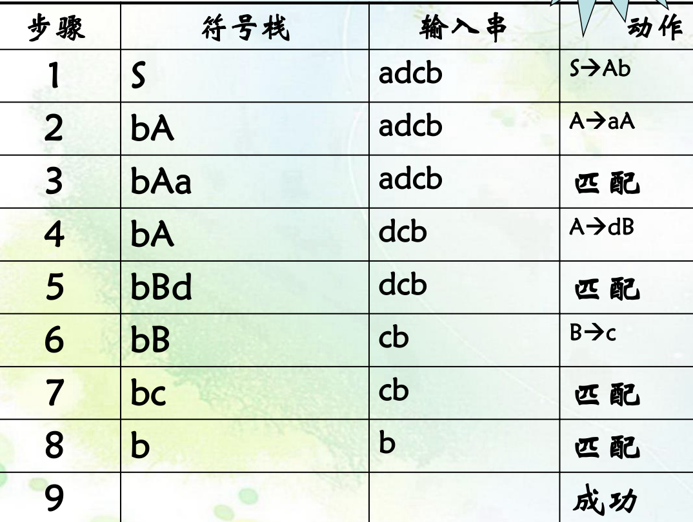
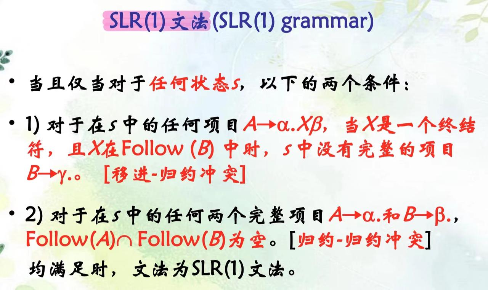
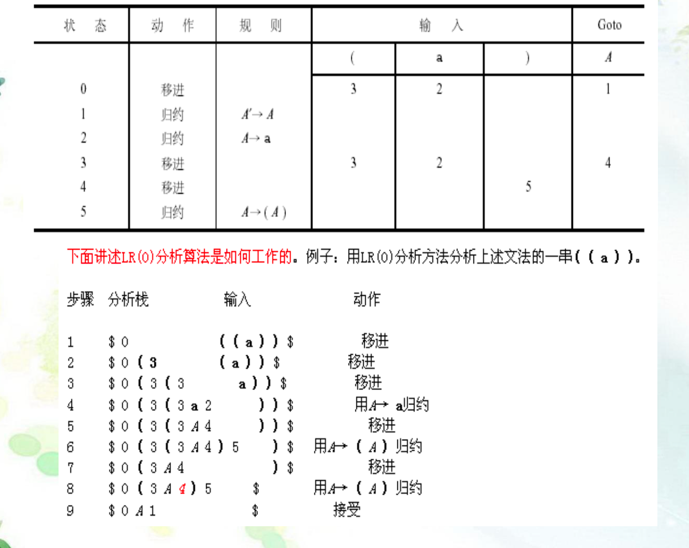
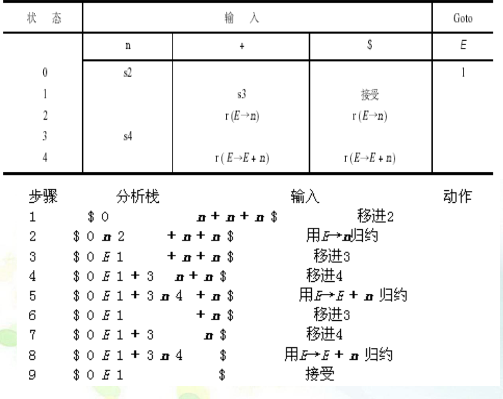
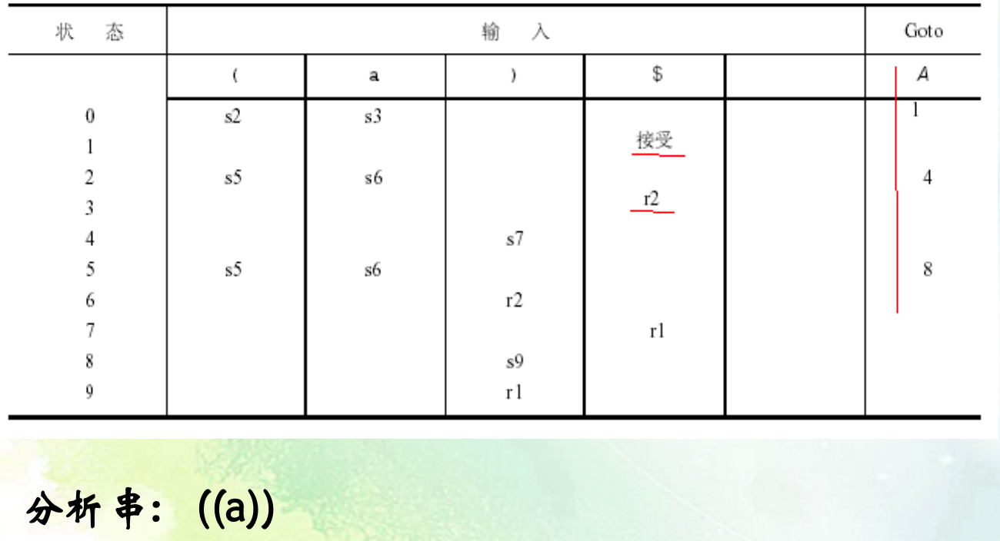
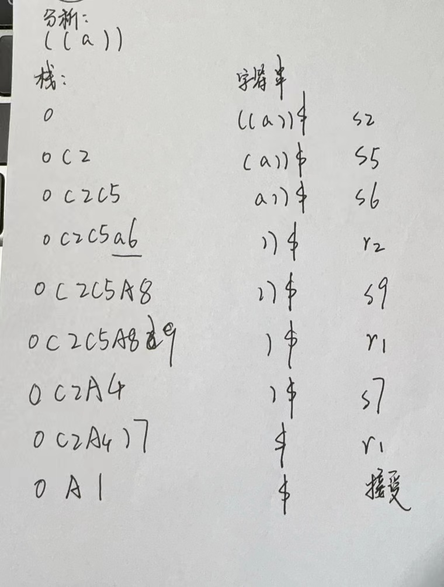

期末考纲复习

## 第一章

### 1. 程序语言的分类.
  - 低级语言
    - 汇编语言
    - 机器语言
  - 高级语言（C++，Java）

### 2. 程序翻译的方式有哪几种?有何不同?
  - 编译程序
    - 书面翻译
    - 需要编译器，生成目标代码，较难实现跨平台
  - 解释程序
    - 即席翻译
    - 需要解释器，容易实现跨平台
   
### 3. 编译程序包含有多少个阶段,各阶段的功能任务分别是什么?

1. 词法分析：识别不同的Token
2. 语法分析：生成AST
3. 语义分析
   1. 数据类型分析
   2. 作用域分析
4. [源代码集优化]
5. 中间代码生成
   1. 三，四元组
   2. 树型
   3. 伪代码
   4. 逆波兰
6. 目标代码生成
7. 目标代码有关
   1. 跟机器相关的优化
   2. 跟指令特点相关的优化

## 第二章

### 1. 正则表达式运算以及构建方法

略

### 2. 正则表达式$\rightarrow NFA \rightarrow DFA \rightarrow DFA$最小化

#### 1. DFA的严格定义
DFA $M$ 由字母表$\Sigma$，状态集合$S$，转换函数$T: S \times \Sigma \rightarrow S$，初始状态$S_1 \in S$及接受状态集合$A \subset S$组成

#### 2. NFA的严格定义

NFA $M$ 由字母表$\Sigma$，状态集合$S$，转换函数$T: S \times (\Sigma \cup \{\epsilon\}) \rightarrow \phi(S)$，初始状态$S_1$及接受状态集合$A$组成

#### 3. 正则表达式转NFA

#### 4. NFA转DFA

#### 5. DFA最小化

### 6. 词法分析程序的生成方法

```cpp


string resultCode;
// 生成词法分析器代码并返回为字符串
void generateLexerCode() {
    ostringstream codeStream; 

    codeStream << "#include <iostream>" << endl;
    codeStream << "#include <string>" << endl;
    codeStream << endl;
    codeStream << "using namespace std;" << endl;
    codeStream << endl;
    codeStream << "int main() {" << endl;
    codeStream << "    string input;" << endl;
    codeStream << "    cin >> input;" << endl;
    codeStream << "    int currentState = 0;" << endl;
    codeStream << "    int length = input.length();" << endl;
    codeStream << "    for (int i = 0; i < length; i++) {" << endl;
    codeStream << "        char c = input[i];" << endl;
    codeStream << "        switch (currentState) {" << endl;

    for (const dfaMinNode& node : dfaMinTable) {
        codeStream << "            case " << node.id << ":" << endl;
        codeStream << "                switch (c) {" << endl;
        for (const auto& transition : node.transitions) {
            if (transition.second != -1) {
                codeStream << "                    case '" << transition.first << "':" << endl;
                codeStream << "                        currentState = " << transition.second << ";" << endl;
            }
            codeStream << "                        break;" << endl;
        }
        codeStream << "                    default:" << endl;
        codeStream << "                        cout << \"Error: Invalid input character '\" << c << \"'\" << endl;" << endl;
        codeStream << "                        return 1;" << endl;
        codeStream << "                }" << endl;
        codeStream << "                break;" << endl;
    }

    codeStream << "        }" << endl;
    codeStream << "    }" << endl;
    codeStream << "    switch (currentState) {" << endl;

    for (const dfaMinNode& node : dfaMinTable) {
        if (node.flag.find("+") != string::npos) {
            codeStream << "        case " << node.id << ":" << endl;
            codeStream << "            cout << \"Accepted\" << endl;" << endl;
            codeStream << "            break;" << endl;
        }
    }

    codeStream << "        default:" << endl;
    codeStream << "            cout << \"Not Accepted\" << endl;" << endl;
    codeStream << "    }" << endl;
    codeStream << "    return 0;" << endl;
    codeStream << "}" << endl;

    resultCode = codeStream.str();
}
```

### 4. 实验一与实验二

## 第三章

### 1. 文法、语言?

#### 1. 上下文无关文法

一个上下文无关文法CFG是一个四元组$G = (V_N, V_T, P, S)$且$V_T \cap V_N = \empty, S \in V_N$，产生式形如$A \rightarrow \alpha, A \in V_N, \alpha \in (V_N \cup V_T)^*$

- 文法：
  - 非终结符号
  - 终结符号
  - 规则集
  - 开始符号

#### 2. 语言

- 语言是一切句子的集合
- 程序设计语言是一切程序的集合
- 程序是语言的句子

### 2. 文法的分类是怎样的?它们之间有何关系?

Chomsky分类法：
1. 0型文法(图灵机)
$G = (V_N, V_T, P, S)$的产生式形如：

$$\alpha \rightarrow \beta$$

其中$\alpha, \beta \in (V_N \cup V_T)^*$，但$\alpha$中至少包含一个非终结符。（0型语言或递归可枚举语言）

2. 1型文法(线性限界自动机)
$$\alpha \rightarrow \beta, |\alpha| \leq |\beta|$$

仅$S \rightarrow \epsilon$是例外，且$S$不出现在产生式的右部

3. 2型文法(下推自动机)
$$A \rightarrow B, A \in V_N, \beta \in (V_N \cup V_T)^*$$

上下文无关文法

4. 3型文法(有穷状态自动机)
$$A \rightarrow aB, \text{ or } A \rightarrow a, A, B \in V_N, a \in V_T \cup \{\epsilon\}$$

正规，正则文法

### 3. 推导、规约、语法树、文法的二义性？

#### 1. 推导

使用产生式的左部替换产生式的右部

#### 2. 归约

使用产生式的右部替换产生式的左部

- 最左推导 = 最右归约， 最右推导 = 最左归约
- 规范推导 = 最右推导， 规范归约 = 最左归约

#### 3. 语法树

因为分析树中的内容过于复杂且耗费空间，所以将所需要的信息压缩形成语法树
- 只保留后续有用的信息
- 分析效率高

#### 4. 文法二义性

一个文法的一个句子存在多个不同的语法树则称该文法是二义性的

二义性的判定和消除无通用手段，但在特殊情况可以使用特殊方法消除二义性

- 一个程序设计语言的文法应该是无二义性的
  - 如果有二义性
    - 构造等价无二义性的文法

### 4. 如何画语法树？

- if 语句
  - 测试部分
  - then 部分
  - else 部分

### 5. 文法二义性的消除方法有多少种？

1. 在分析程序中添加一个限制程序
2. 改造文法
3. 改变语法
4. 利用LL(1)分析表中每个项目最多只能有一个规则来消除文法二义性
5. 

### 重点
### 6. 文法的构建问题
略

```
program -> stmt-sequence
stmt-sequence -> statement { ; statement }
statement -> if-stmt | repeat-stmt | assign-stmt | read-stmt | write-stmt | while-stmt | for-stmt |
prefix
if_stmt -> if(exp) stmt-sequence [else stmt-sequence] endif
while-stmt -> while (exp) stmt_sequence endwhile
for-stmt -> for (identifier := exp; exp; (++|--)identifier) stmt_sequence endfor
repeat-stmt -> repeat stmt-sequence until exp
assign-stmt -> identifier ((:= exp) | (== reg_stmt))
read-stmt -> read identifier
write-stmt -> write exp
exp -> simple-exp [ comparison-op simple-exp ]
comparison-op -> < | = | > | <= | >= | <>
simple-exp -> term { addop term }
addop -> + | -
term -> power { mulop power }
mulop -> * | / | %
power -> prefix { powerop prefix }
powerop -> ^
prefix -> [prefixop] factor
prefixop -> ++ | --
factor -> (exp) | number | identifier
reg_stmt -> reg_union { unionop reg_concat}
unionop -> |
reg_concat -> reg_sin { concatop reg_sin}
concatop -> &
regsin -> reg { regsinop }
regsinop -> # | ?
reg -> (reg_stmt) | identifier | number
```

### 7. 自顶向下分析法的问题: 左公共因子、左递归
1. 提取左公因子
   - 手工改写
   - 用EBNF改写
2. 消除回溯性
3. 消除左递归
   1. 直接左递归
   2. 间接左递归

### 8. 文法的简化

- 无效规则
  - 有害规则
    - $U \rightarrow U$，导致文法二义性
  - 多余规则
    - 文法中任何句子的推导都不会用到
      - 不在规则右部出现的非终结符**不可到达**
      - 不能推出终结符号的非终结符**不可终止**

符号化表示

$\forall A \in V_N$在句子推导中
1. $\exists S \Rightarrow \alpha A \beta$，其中$\alpha, \beta \in V^*$
2. $\exist A \Rightarrow t$，其中$t \in V_T^*$

### 9. First 与follow集合(实验四)

- First看产生式右边
- follow看在产生式中的后一个或者产生式的左边

## 第四章

### 1. 递归下降语法分析方法(或称递归子程序)
- 自顶向下分析法：
  - 从文法开始符号开始，不断利用文法规则进行推导，直到推导出所要分析的符号串

- 预测RDP:
  - 无左递归
  - 无回溯性

- 递归下降分析法
  - 每个非终结符按其规则结构产生相应语法分析子程序
    - 终结符产生匹配命令
    - 非终结符产生调用命令  

- 可能存在的问题
  - BNF -> EBNF 可能会产生困难
  - 出现$A \rightarrow \epsilon$如何写程序
  - 左边出现第一个终结符好选择，若存在左递归无法选择
  - 间接左递归将出现死递归
  - 可能存在左公因子

### 2. LL(1)分析方法
- 定理：满足以下条件的BNF文法为$LL(1)$文法 
1. $\forall A \rightarrow \alpha_1 | \cdots | \alpha_n, \forall 1 \leq i, j \leq n$
$$First(\alpha_i) \cap First(\alpha_j) = \phi$$
2. $\forall A \in V_N$, where $\epsilon \in  First(A), then First(A) \cap Follow(A) = \phi$

### 3. LL(1)判断方法
同上

### 4. LL(1)分析表
1. $\forall A \rightarrow \alpha$
    - 将$First(\alpha)中每个a, M[A, a] = \alpha$
    - 若$\epsilon \in First(\alpha), \forall b \in Follow(A), M[A, b] = \alpha$
    - 其余置空或错误

### 5. LL(1)分析过程

- 实验三

## 第五章

自底向上：从要分析的终结符串开始归约，找子串并用产生式的右部替换左部直至归约至开始符号

### 1. LR(0) DFA、LR(1) DFA、 LALR(1) DFA？
略

### 2. LR(0)分析表、LR(1)分析表、 SLR(1)分析表、LALR(1) 分析表？

### 3. LR(0)文法、LR(1)文法、SLR(1)文法、 LALR(1)文法？如何判断LR(0)文法、SLR(1)文法？

- 只要LR(0)的DFA图的状态中同时出现了移进与规约，就不是LR(0)


### 4. 文法如何利用LR(0) 、LR(1) 、 SLR(1)、LALR(1)进行语法分析？







