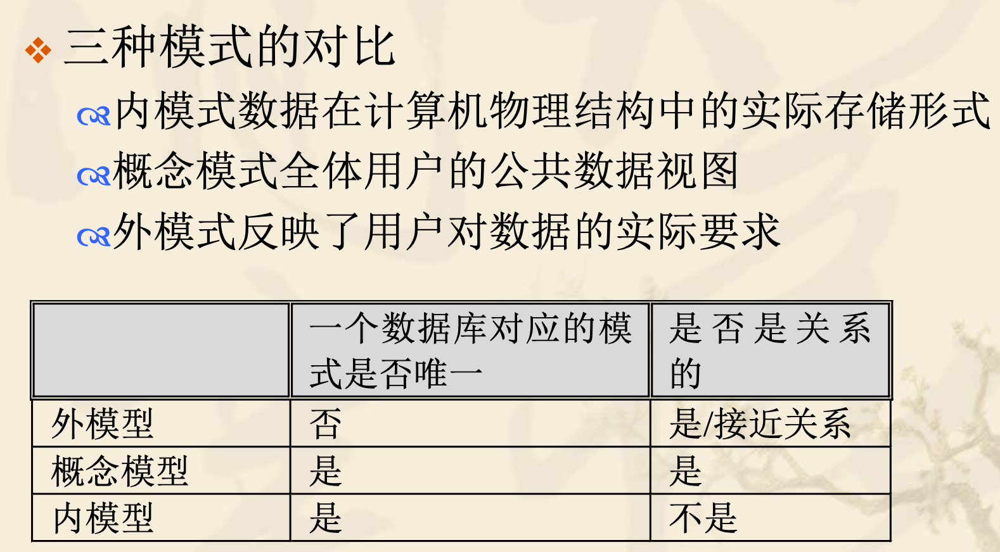

### 1. 四个概念：什么是数据?  什么是数据库? 什么是数据库管理系统（DBMS）？什么是数据库系统(DBS)？

- 数据是指对客观事件进行记录并可以鉴别的符号

- 数据库：数据库（database）是“按照数据结构来组织、存储和管理数据的仓库”。是一个长期存储在计算机内的、有组织的、可共享的、统一管理的大量数据的集合。

- 数据库系统：数据库系统DBS（Data Base System，简称DBS）通常由软件、数据库和数据管理员组成。其软件主要包括操作系统、各种宿主语言、实用程序以及数据库管理系统。

- 数据库管理系统：数据库管理系统(Database Management System)是一种操纵和管理数据库的大型软件，是用于建立、使用和维护数据库，简称DBMS。它对数据库进行统一的管理和控制，以保证数据库的安全性和完整性。

- 数据库由数据库管理系统统一管理，数据的插入、修改和检索均要通过数据库管理系统进行。

### 2. 熟记数据库系统的组成。
- 数据库
- 数据库管理系统
- 支持数据库运行的软、硬件环境
- 用户

### 3. 理解DBA是对数据库进行集中控制和管理的最重要人员。

### 4. 实例和模式的对比（内容/状态 vs 结构，变化 vs 稳定）

- 实例（内容/状态）：数据库在某一时刻的数据集合。实例是动态的，会随着数据的插入、删除和更新而变化。
- 模式（结构）：数据库的逻辑结构和特征的描述。模式是相对稳定的，定义了数据库的组织方式。

### 5. 熟记三级模式：

物理模式（又称内模式、存储模式），逻辑模式（又称模式），和子模式（又称外模式）的含义是什么？

- 概念模式:
是数据库系统中全局数据逻辑结构和特征的描述，**是全体用户的公共数据视图**，这种描述是一种抽象描述，不涉及具体硬件平台与软件环境。概念模式主要描述数据的概念记录类型和它们之间的关系，还包括一些数据间的语义约束。
- 外模式:
是用户和数据库系统的接口，**反映了用户对数据的实际要求**。外模式是与某一具体应用有关的数据的逻辑结构和特征描述。概念模式给出系统全局的数据描述，外模式则给出每个用户的局部描述，即外模式为用户所见到的概念模式的一个部分。
- 内模式:
是数据库物理结构和存储方式的描述，即数据库 的“内部视图”。内部视图是整个数据库的底层 表示，它由内部记录型中各个类型的值组成。内 模式定义了数据库中的各种存储记录、存储记录 的物理表示、存储结构与物理存取方法，如数据 存储的文件结构、索引、集簇等存取方式和存取 路径等。**一个数据库只有一个内模式**。

一个数据库有几个物理模式，逻辑模式和子模式？ 
1, 1, 多个

三级模式间的两极映射，以及是由谁完成这种映射功能的？
**DMBS**

两级映射的作用（好处）是带来以下两种数据独立性

- 两级映射：
    - 外模式/模式映射：由DBMS负责，将子模式映射到逻辑模式。
    - 模式/内模式映射：由DBMS负责，将逻辑模式映射到物理模式。
- 两级映射的作用：
- 逻辑数据独立性：指应用程序和数据的逻辑结构之间的独立性。用户可以在不改变逻辑模式的情况下对外模式进行修改。
- 物理数据独立性：指应用程序和数据的物理存储之间的独立性。用户可以在不改变逻辑模式的情况下对物理模式进行修改。

### 6. 熟记两种数据独立性：什么是逻辑数据独立性？什么是物理数据独立性？用户或者应用程序面向的到底是哪一级数据库模式？

- 对于数据库物理结构的改变，如果概念模式保持不变，系统就提供了物理独立性.
- 对于数据库逻辑结构的改变(在概念或逻辑概念层的改变)如果用户和用户的应用程序能保持不变，系统就提 供了逻辑独立性.
- 用户或应用程序面向的是子模式（外模式）。

### 7. 概念数据模型用于数据库设计，是对客观世界的第一层抽象。常见例子是E-R模型。