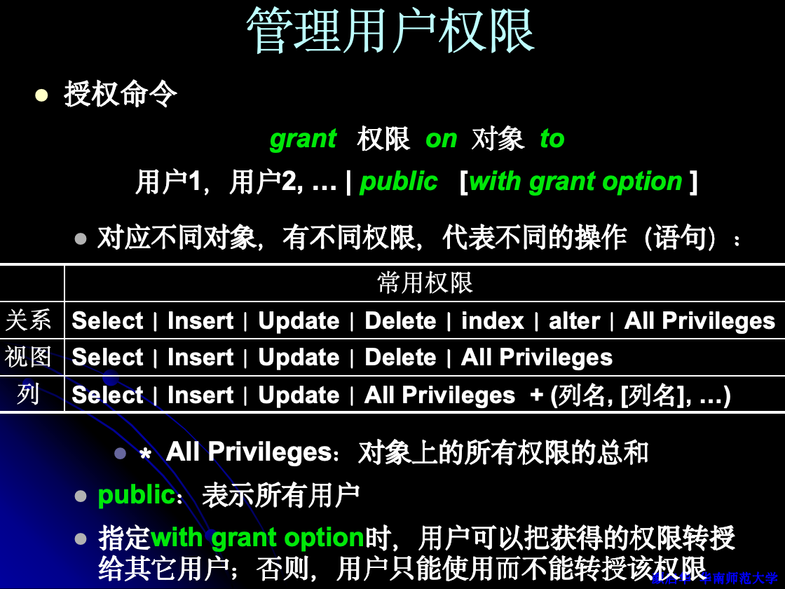
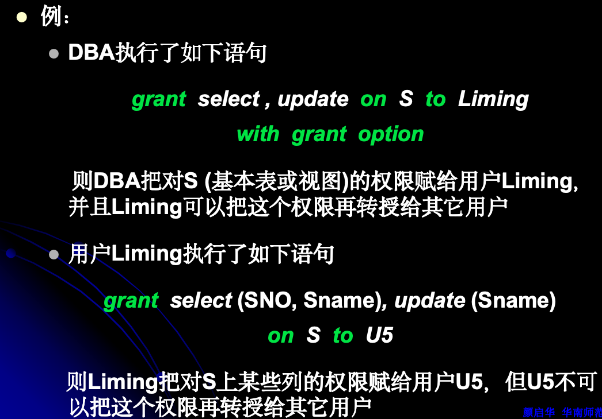
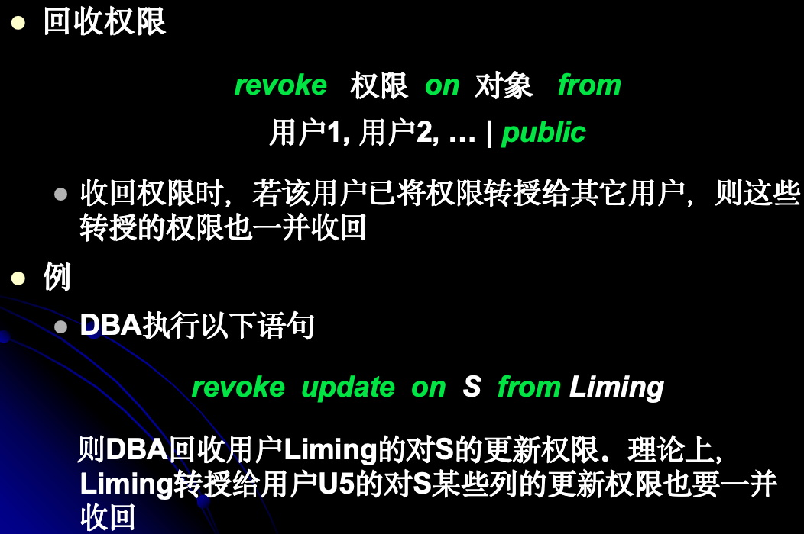
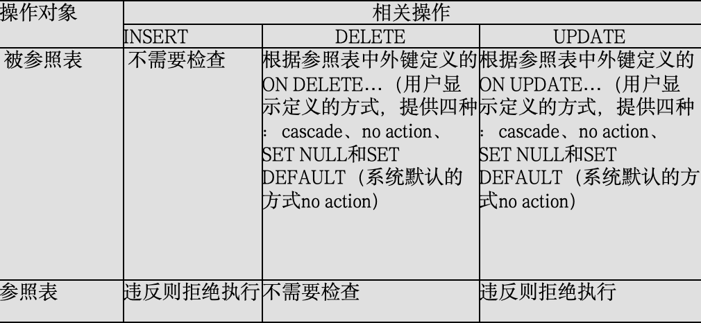
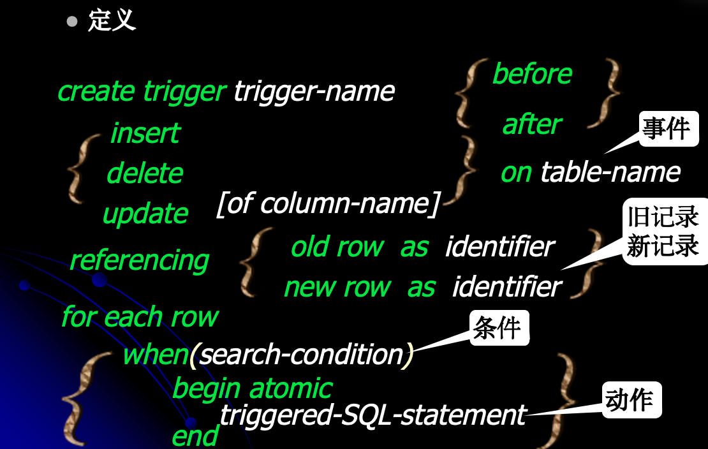

### 1、安全性定义

- 安全性是防止非法用户进入数据库，以及合法用户进入数据库后做了（未授权的）非法操作。
- 完整性是防止非法数据进入数据库，即使是合法用户及合法操作产生的。
  - 目的：防止非法、不合语义的数据被输入和输出，即所谓的“垃圾进垃圾出”（Garbage In Garbage Out）

### 2. 掌握用SQL授予权限和回收、禁止权限的语句(grant, revoke, deny)。with grant option子句的作用。







### 3. 理解常见权限的含义。（例如 insert on (table) S, update on (view) A等

- 预备概念: 权限
  - 代表用户能够对某个对象进行某个操作的能力。每一个用户都分配有一组权限，代表他所能够做的操作。
- 存取控制机制的两个方面
  - 管理用户权限：
    - 通过两个SQL语句——GRANT语句授予用户以权限，REVOKE语句回收用户的权限。
  - 检查用户权限：
    - 用户要对某个对象进行某个操作时，DBMS首先会检查用户是否被授予了相应的权限，以决定是响应还是拒绝用户请求

- 不同用户之间的权限传递
    - DBA是最高用户，具有全部权限，并且这些权限不能被回收
    - DBA可以把这些权限授予给其它用户，也可以从其它用户那里回收权限
    - 允许用户把已获得的权限再转授给其他用户，或者回收转授给其他用户的权限

### 4. 理解完整性的含义：正确、有效、相容。完整性约束（规则）是数据为保证完整性所必须满足的条件。

- 完整性的原义
  - 数据的完整性，指数据的正确性、有效性和相容性
- 然而大多数情况下，我们所提到的完整性，实际是指完整性规则
  - 为保证完整性，数据应该满足的约束条件
  - 又称为完整性约束

### 5. 熟记关系模型中的三类完整性规则。各有什么要求？理解哪些（修改）操作会破坏这些规则？

- 完整性又称为关系完整性，是三要素（关系, 关系完整性, 关系操作）之一，包括三种完整性规则
1. 实体完整性；
    - 规则：元组在主码上取唯一值，且每个属性均不能为空
    - 要点：如果一个关系的主码由多个属性构成，那么每个属性都不能取空值
    - 意义：在实体映射为元组后，不同元组靠主码来相互区分。保证每一元组/实体，可与其它元组/实体是可区分的。
        - 删除（无需检查）
        - 插入 ：如果插入的记录中如果主键值有空或者重复，则违反了规则，拒绝插入，甚至回滚事务
        - 修改：如果修改的主键值有空或者重复，则拒绝插入，甚至回滚事务


2. 参照完整性；
- 定义：关系R1中的单个属性或属性集合，对应另一个关系R2的主码,R1称为参照关系， R2称为被参照关系
- 规则：如果关系R的外部码对应关系S的主码，则R每个元组在外部码上的取值必须满足：
  - 要么等于空值
  - 要么等于某个对应的主码值（S某个元组的主码值）
- 意义：元组/实体的外部码，说明跟另外哪一个元组/实体（的主码）相联系的。保证这一联系有意义，不会联系不存在的元组/实体。

3. 用户定义完整性；
- 规则：用户根据具体的应用环境定义
  - 例如
    - 年龄的取值范围为0到200，性别只能是“男”或“女”
    - 职工编号是4位整数
- 意义：
  - 保证元组/实体的属性取值合理，反映现实世界的真实情况
  - 反映了程序编制的要求


### 6. 掌握用SQL定义主码约束、外码约束、非空(not null)约束、唯一(unique)约束、域约束、检查(check)约束的语句？以及这些约束的含义、作用。

定义：在创建或修改关系的定义语句中，用PRIMARY KEY关键字声明主码的同时，即定义了一个主码约束

```sql
create  table  关系名
(
    ……
    [ , primary  key (属性 {, 属性}) ]
    ……

)
create  table  选修  (
　　学号  VARCHAR (10),
　　课程号  VARCHAR (10),

　　……,
　　primary  key  (学号, 课程号),
　　……
)
```

定义：在创建或修改关系的定义语句中，用FOREIGN KEY关键字声明一个外部码的同时，即定义了一个外部码约束

```sql
create table 表名    
(    
    ……
    { , foreign  key   (属性名 {, 属性名})  
　　   　references  关系名 (属性名 {, 属性名}) 
　　　　 on  delete  <参照动作>
　　　　 on  update  <参照动作>}
　　　   ……
)
```

- 唯一约束
  - 规则：对指定的一个属性或属性组合，不允许出现重复值
  - 定义：在创建或修改关系的定义语句中，用Unique关键字声明

```sql
create  table  关系名
(
    ……
    [ , unique (属性 {, 属性}) ]
　   ……
)

create  table  学生  (
　　　　　……,
　　　　　身份证号  VARCHAR (15),

　　　　　……,
　　　　　unique  (身份证号),
　　　　　……
　　　)

```
- 非空约束
  - 规则：属性值不允许取空值
  - 定义：在定义关系的语句中，声明某个属性不能取空值（not null），即定义了一个非空约束
```sql
　　　create  table   关系名
           (
　　　　　……,
　　　　　属性名  域  [default  缺省值]  [not null]
　　　　　……,
　　　)

create  table  学生 (
　　　　　……,
　　　　　姓名  VARCHAR(20)  not  null,
　　　　　……,
　　　)

```

- 域约束
  - 规则：域中的值要满足用户指定的条件
  - 目的：间接地约束属性。因为如果把某个属性声明为这个域（数据类型），则该属性的取值也必须满足这一条件
  - 定义：在创建域的语句中，用constraint子句说明约束的名称和条件
```sql
　　　create  domain   用户域名   预定义域  
　　　　　[ constraint  约束名  check (条件) ]

create  domain  Age_Domain  SMALLINT  
　　　　　 constraint   Age_Constraint
　　　　　 check (value>=0  AND  value<=200)

　　　create  table  学生(
　　　　　学号  VARCHAR (4),
　　　　　姓名  VARCHAR (20),
　　　　　年龄  Age_Domain,
　　　　　primary  key  (学号),
　　　　　……
　　　)
```

- 检查约束
  - 规则：关系中每一个元组的各个属性值间，必须满足用户指定的条件
  - 定义：在创建或者修改关系的语句中，用check子句声明检查约束

```sql
　　　create  table   关系名       (
　　　　　……,
　　　　　……,
　　　　　[ , check  (条件) ] 
　　　)

create  table  CET4 
(
    sno     VARCHAR (20),
    grade  VARCHAR (10),
    result  FLOAT,
    primary  key  (sno),
    check (
        (grade=“及格”  and result between 420 and 710) or
        (grade=“不及格” and result between 0 and 419)
    )
)
```

### 7. 在定义外部码约束时，有哪几种参照动作？代表什么意义？
- 说明当某个主码值被删除/更新时（这个主码值在被参照关系中），如何处理对应的外部码值（这些外部码值在参照关系中）
  - RESTRICT 方式：仅当没有任何对应的外码值时，才可以删除/更新这个主码值，否则系统拒绝执行此操作
  - CASCADE 方式：连带将所有对应的外码值一块删除/更新（删除外码值，实际上就是将所在的元组删除掉）
  - SET NULL 方式：将所有对应的外码值设为空值



### 8. 断言不作要求

### 9. 熟记以下全部 触发器的概念。触发器有哪些作用？触发器/ECA规则构成的三个方面，包括英文单词。哪些事件会激活（INSERT,UPDATE,DELETE操作）。

- 触发器
  - 概念：一种“自动执行”的过程。
  - 构成
    - 事件：说明什么时候激活（执行）触发器
    - 例如：Insert、Update、Delete等
  - 条件：说明满足什么条件时，才执行下面的动作
    - 例如：年龄>1000
  - 动作：说明（条件成立后）要执行的代码
    - 例如：报警

- 作用
  - 保证数据完整性
  - 审计。例如，追踪一个用户访问数据库的时间。
  - 满足特定条件时自动执行某项任务。例如，库存不足时，自动生成一张订单



- 事件（Event）: 触发器响应的数据库操作，可以是以下几种：

    - INSERT: 当一条新记录被插入到表中时触发。
    - UPDATE: 当表中的一条记录被修改时触发。
    - DELETE: 当表中的一条记录被删除时触发。
- 条件（Condition）: 触发器在事件发生后检查的布尔表达式。只有当条件为真时，动作才会被执行。如果没有条件，动作将在事件发生时总是被执行。
- 动作（Action）: 触发器在条件为真时执行的操作。动作可以是SQL语句或一系列的SQL语句，如插入数据、更新数据、删除数据或调用存储过程。

### 10. 安全性控制

- 安全性控制
  - 目的：保证数据库的任何部分都不会受到未授权（未经许可）的访问和修改，防止数据泄露和被破坏
- 两类安全性问题和解决机制
  - 非法用户
    - “非授权的使用”：未经许可的用户进入和使用数据库。
    - 解决这一问题的方法为系统保护机制，即设置用户帐号和密码
  - 非法操作
    - “非授权的存取”：经过许可的用户进入数据库系统后，对某些数据进行了未经许可的操作。
    - 解决这一问题的的方法称为存取控制机制
